# LinkWink social media app

>In ToDO Application we use Rest Api as backend. This REST API is build in NodeJs,ExpressJs and Mongodb . IDE VISUAL STDIO CODE and the API tested on 

>For Android Application Development we use IDE ANDROID STDIO and java.

## Features Of Application

&rarr; ToDo App handles your daily routine. some times you forgot to do your works.

&rarr; Our App is very concern about your precious time. 

&rarr; And this app will definitely help you todo your works on very right time.

### Firstly you have to login or register to our app with right email and password.

 | LinkWink Splash Screen            
:-------------------------:
  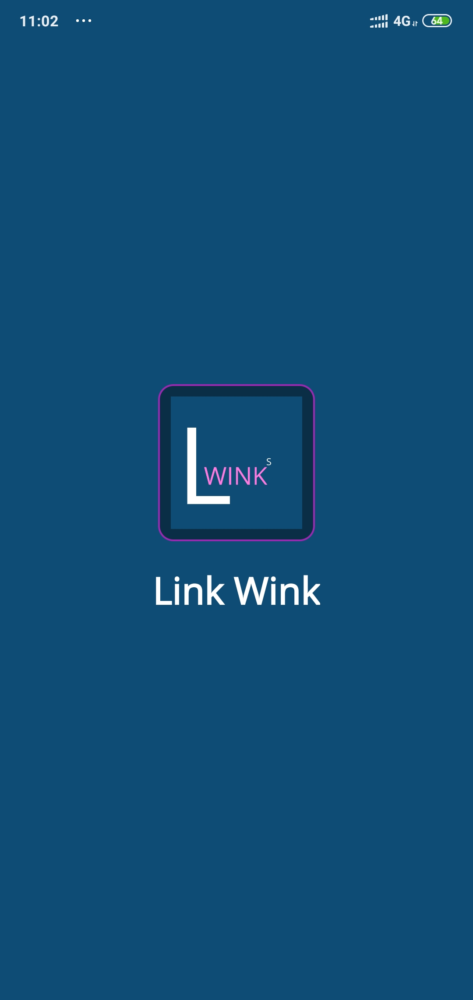  

### Registration System

Register Screen             |  Phone OTP Verification         |  Add User Details
:-------------------------:|:-------------------------:|:-------------------------:
 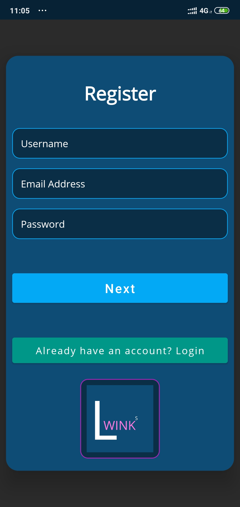  | 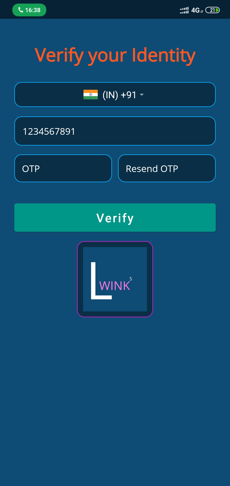 | 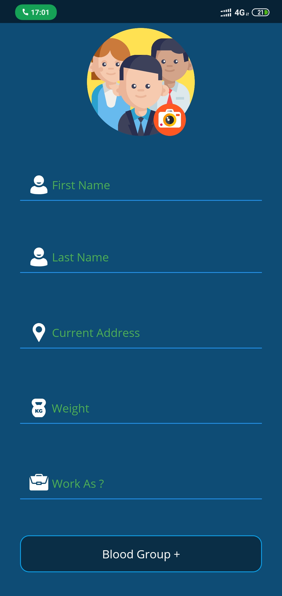

//hi

### Login System

 Login With Email orUsername             |  Login Witth Phone
:-------------------------:|:-------------------------:
 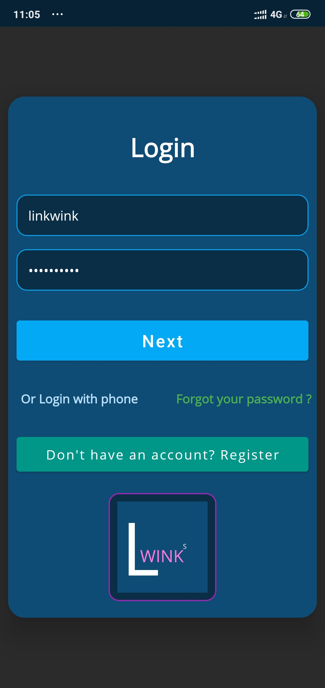  | 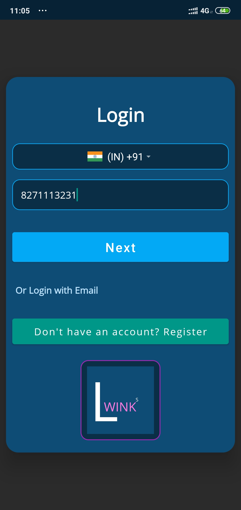

### User Profile

Current User profile             |  Search User         |  Edit Profile
:-------------------------:|:-------------------------:|:-------------------------:
 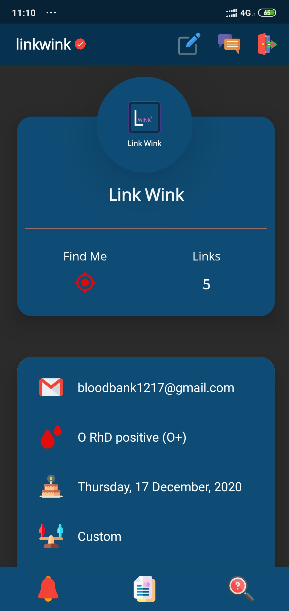  | 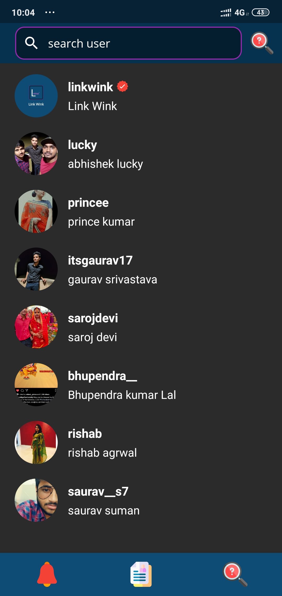 | 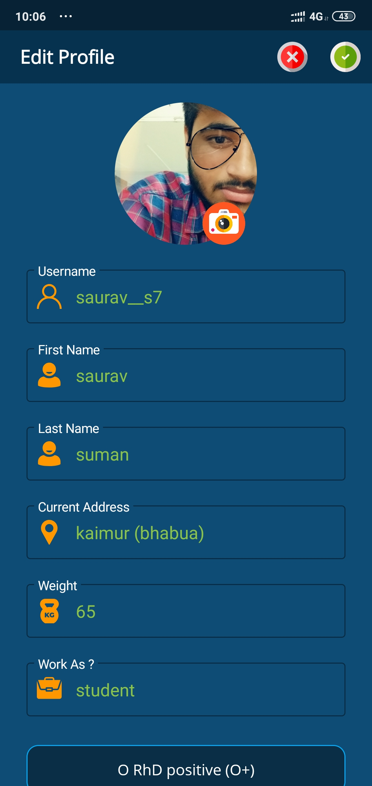

User profile             |  User Links         |  User Chat
:-------------------------:|:-------------------------:|:-------------------------:
 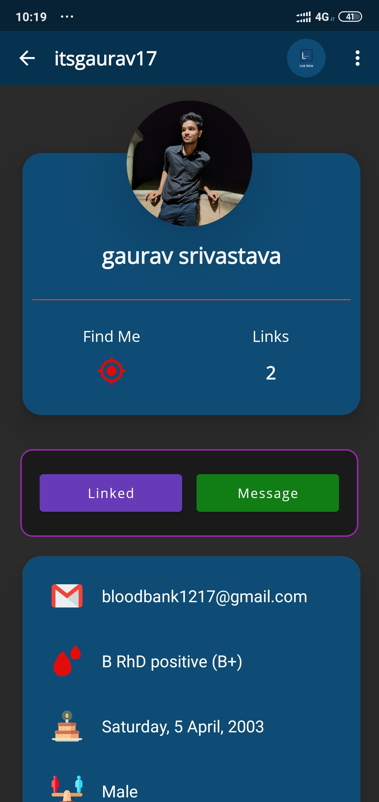  | 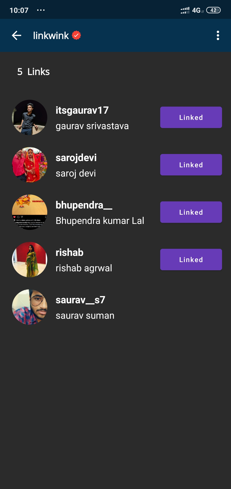 | 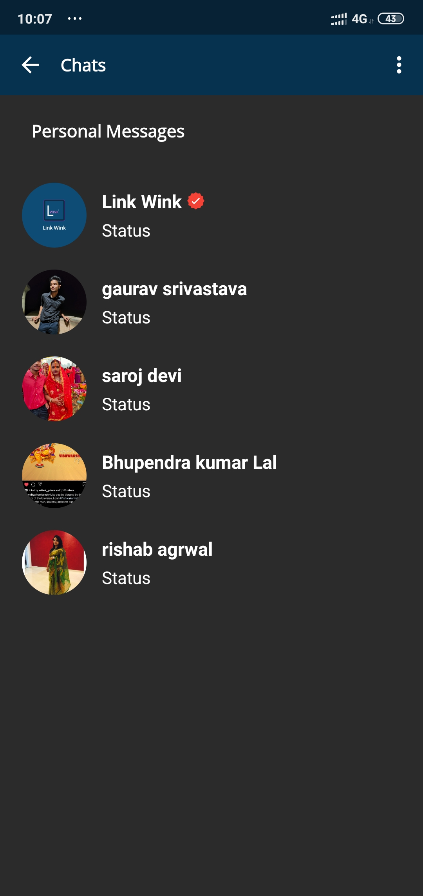

Logout            |  Messages
:-------------------------:|:-------------------------:
 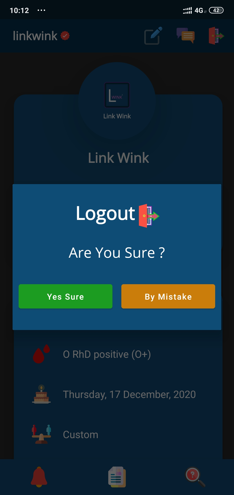  | 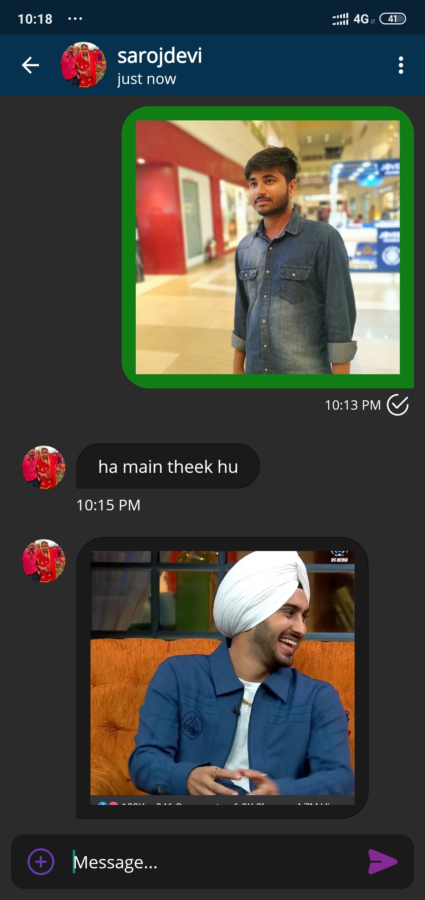

Make Links            |  Link Sent         |  Invitations
:-------------------------:|:-------------------------:|:-------------------------:
 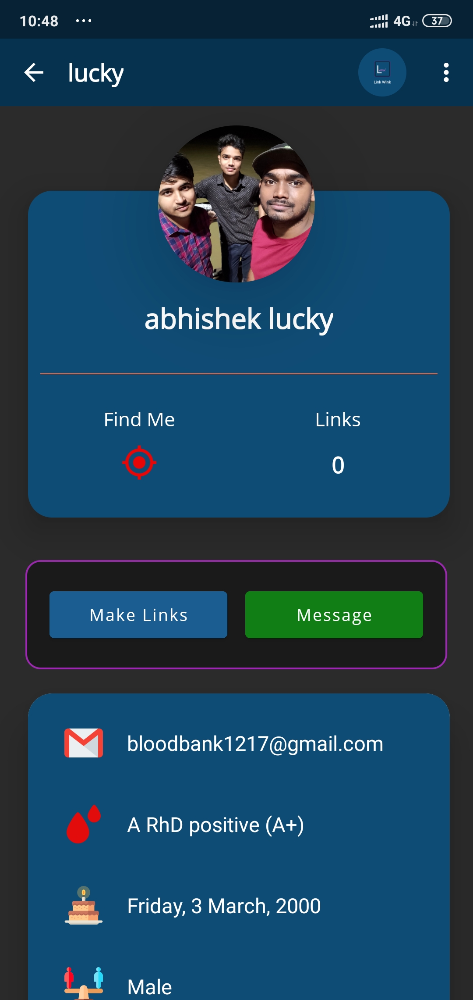  | 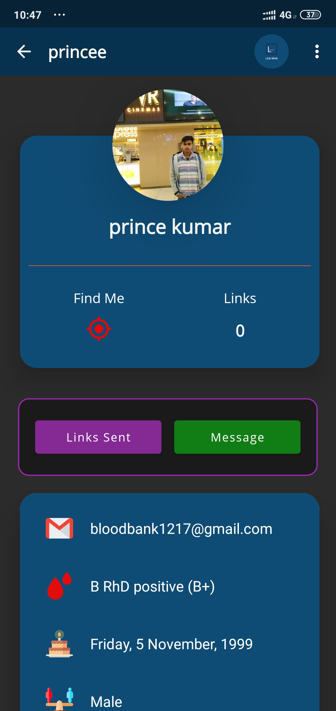 | 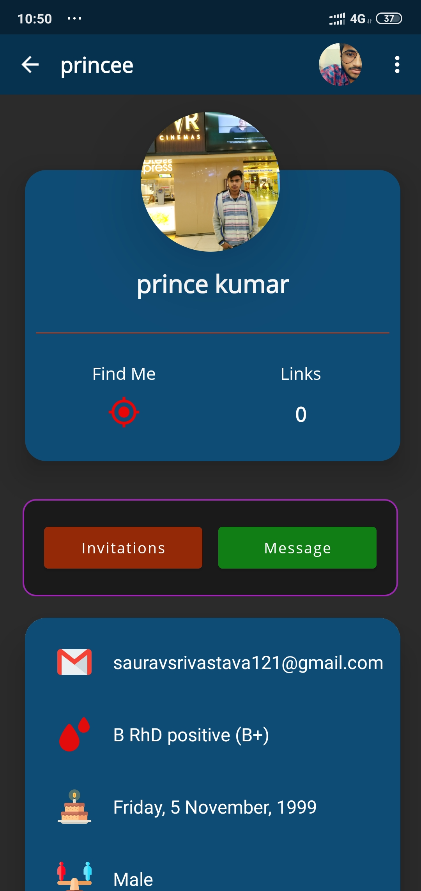

Cancel Requested Links             |  Accept Links         |  Unlinked Links
:-------------------------:|:-------------------------:|:-------------------------:
 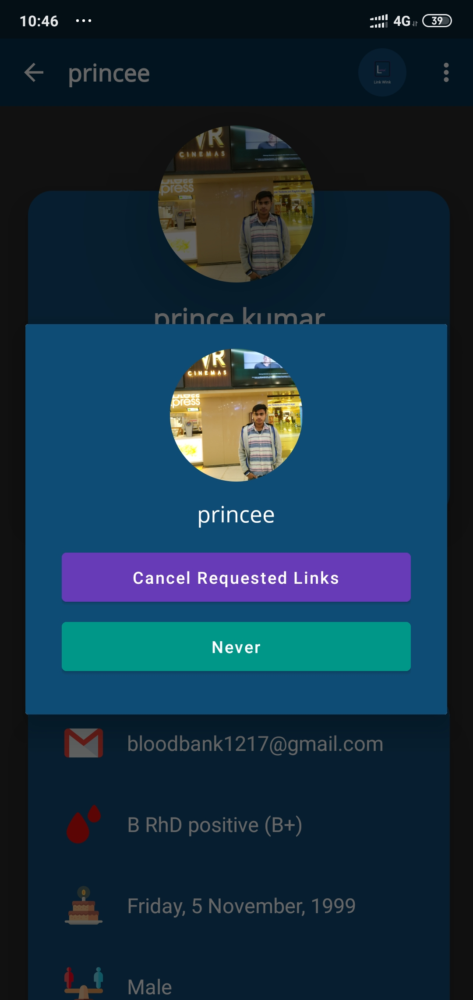  | 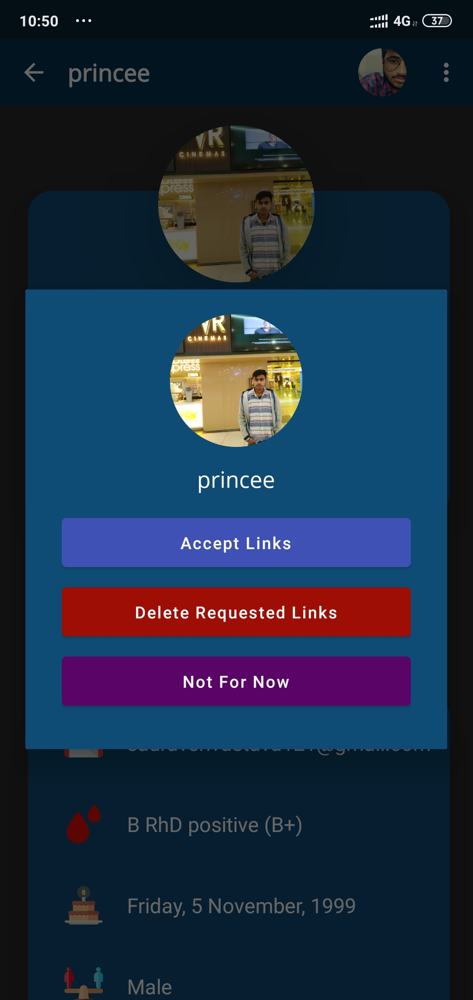 | 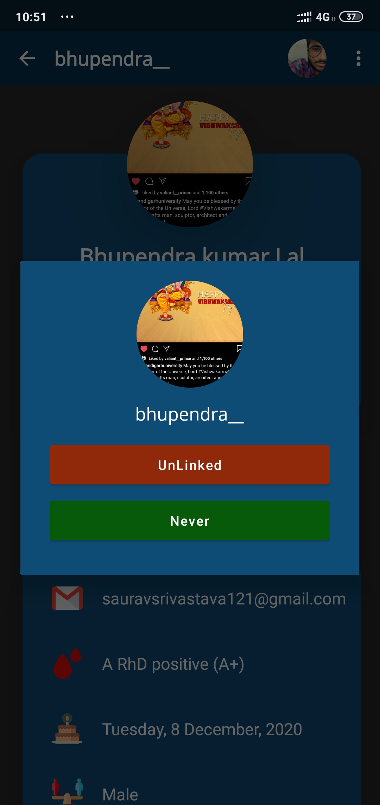

### This is how you can use our software

***
